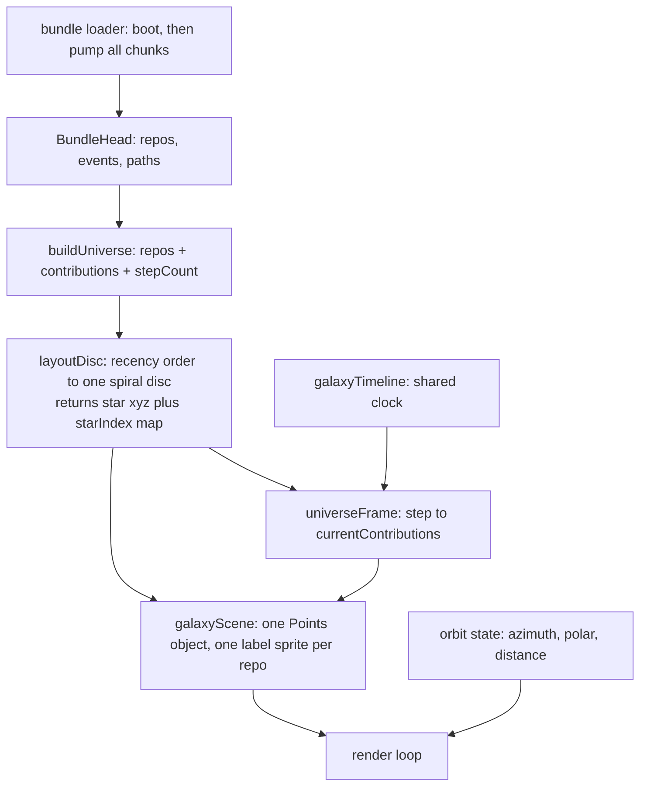

# Galaxy Single Disc - Plan

## Goal Capsule

- **Objective.** Replace the 60 scattered per-repo galaxies with one spiral galaxy covering the full GitHub history, where radius encodes recency, every file is a star that lights permanently when a contributor touches it, and the camera is user-controllable on desktop and touch.
- **Product authority.** The operator (Kevin Weaver). The live site at kevinweaver.dev is the only surface that counts; work reaches it by merging to `main`.
- **Open blockers.** None. Both budget conflicts identified during the brainstorm are resolved in the Planning Contract: KTD2 buys first-byte headroom by relocating the integrity map, and KTD5 avoids the island-chunk overrun by writing a minimal camera controller instead of importing `OrbitControls`.
- **Product Contract preservation.** Product Contract unchanged. Planning resolved both "Resolve before planning" questions without altering scope; those entries are replaced by KTD2 and KTD3.

---

## Product Contract

### Summary

One spiral galaxy for the whole GitHub history: this week's work in the bright core, 2019 projects on the outer arms, every file a star that lights permanently the moment `kw` or `ak` zaps it. All repos stay labeled, and the viewer can rotate and zoom the disc.

### Problem Frame

The galaxy currently renders as 60 separate spiral galaxies scattered on a 6x4 rectangle. Two of them glow; the other 58 are invisible. The operator has reported this three rounds running as "I still just see kevinweaver-dev and aiur only."

Three independent causes produce that single symptom, and only the first has been correctly identified before now.

The dominant cause is data, not rendering. The instrument runtime boots by fetching one event chunk and nothing pumps the remaining 37. The scene therefore contains 2 repos and 507 file-stars out of 60 repos and 16,206 file-stars. Roughly 3% of the data has ever reached the page. No amount of color or camera work makes the other 58 repos appear, because they are not in the scene.

The second cause is contrast. Stars that no contribution has touched render at `0x5c6370` on a `0x1d2021` background under additive blending, which is effectively invisible. Only repos with a contribution at the current playback step are legible.

The third cause is framing and scale. Each galaxy's stars span two world units while galaxy centers span six by four, so the clusters overlap into a single smear; the camera at `z = 2.6` frames a fraction of even that.

Underneath the symptom is a representational problem the current design cannot solve. File counts per repo range from 1 to 7,449, with a median of 25. `aiur-team/aiur` alone holds 46% of every star. Any layout that sizes or places a repo by its volume gives one repo the whole frame.

### Key Decisions

- **One continuous disc, not 60 galaxies.** The universe renders as a single spiral galaxy whose arms are made of every repo's stars; repos read as density clumps along the arms rather than as separate objects. Directional sketches against real data showed the per-repo-galaxy shape degenerates into overlapping mush at 60 repos, while the continuous disc reads unmistakably as one galaxy. (session-settled: user-directed — chosen over discrete per-repo galaxies and over a solar-system treatment: the disc is the only variant that stays coherent at this repo count.)

- **Radius encodes recency, not size.** A repo's distance from the galactic center is set by its most recent activity: the newest work sits in the core, the oldest on the rim. This makes the galaxy readable as a timeline at a glance and defuses the `aiur` dominance problem, because volume no longer buys position. (session-settled: user-directed — chosen over size-ordered or hash-scattered placement: "cluster the most recently active repos near the center... older projects further out on arms".)

- **Every repo is labeled, always; collisions are acceptable.** Legibility of the full repo set outranks a clean frame. Recency ordering spreads labels radially, which limits collisions in practice, but overlap is explicitly tolerated rather than solved by hiding labels. (session-settled: user-directed — chosen over labeling only the largest repos or only the repos active on the current day: "all repos, colliding is okay".)

- **Zapped stars stay bright forever.** A star's brightness is cumulative history, not current state. Unzapped stars are dim but visible; a contribution promotes a star permanently. The playback therefore paints a brightening galaxy rather than a blinking one. (session-settled: user-directed — "stars should glow brighter once zapped, lets leave them bright".)

- **Drag rotates the camera, so scrubbing leaves the canvas.** The galaxy canvas currently maps a pointer's absolute x position to an absolute day index, so any press teleports the timeline. Camera drag and position-mapped scrubbing cannot share one surface. Seeking moves to the contribution graph, which already writes the shared timeline store. This is the one decision in this contract the operator has not explicitly ratified.

### Actors

- A1. `kw` — the human contributor (`its-everdred`), actor id 0. Rendered as a moving node that fires beams at the files committed on the current day.
- A2. `ak` — the agent contributor (`its-applekid`), actor id 1. Same behavior, distinct color.
- A3. The viewer — reads the galaxy, controls the camera, and seeks the timeline.

### Requirements

**Galaxy structure**

- R1. The universe renders as a single spiral galaxy with a dense core and sweeping arms, not as multiple discrete galaxies.
- R2. A repo's radial position is a function of its most recent contribution date: the most recently active repo sits nearest the center and the least recently active sits nearest the rim.
- R3. Every repo's stars are distributed along the arm at that repo's radius, smeared enough radially and angularly that adjacent repos blend into a continuous arm rather than forming a visible concentric ring.
- R4. Every file in every repo is a star in the scene, with no per-repo cap that silently drops files.
- R5. Every repo carries a text label positioned at its arm segment, rendered at all times regardless of contribution state. Label overlap is acceptable and must not trigger hiding or culling.
- R6. Star placement is deterministic: the same input data produces byte-identical geometry across renders, with no `Math.random` and no wall-clock input.

**Contribution playback**

- R7. A star that no contribution has touched renders visibly against the background — dim relative to a zapped star, but distinguishable from empty space.
- R8. A star that any contribution has touched at or before the current step renders permanently brighter than an untouched star, and does not revert as playback advances.
- R9. On each step, each actor with contributions that day renders a beam from its node to each file-star it touched, in that actor's color.
- R10. Every contribution on a step produces a beam. If a beam budget is imposed for performance, exceeding it must surface rather than silently drop beams.
- R11. Contributor nodes move to reflect where each actor is working on the current step.

**Camera and interaction**

- R12. On touch, the viewer can pinch to zoom and drag to rotate the galaxy.
- R13. On pointer devices, the viewer can drag to rotate, and zoom via on-screen controls.
- R14. A user-set camera position survives a viewport resize; resize adjusts only the projection aspect.
- R15. Camera controls are reachable by keyboard, matching the mouse and touch affordances.
- R16. Zoom controls meet the 24x24 CSS pixel minimum target size enforced by the accessibility suite.
- R17. The viewer retains a way to seek the timeline after drag-to-scrub is removed from the canvas.
- R18. Under `prefers-reduced-motion: reduce`, no camera motion runs on its own; user-initiated camera changes remain available.

**Data coverage and history**

- R19. The instrument loads every event chunk, so the scene contains all repos and all file-stars rather than only the boot chunk's contents.
- R20. Loading beyond the boot chunk is progressive and must not block first paint or regress the lazy-island chunk contract.
- R21. The published data bundle covers the full GitHub history rather than a window starting in 2021.
- R22. A data-loading failure at any chunk leaves the page rendered with whatever loaded successfully; it must not blank the instrument.

**Budgets and quality gates**

- R23. The first-byte data payload stays within its 12 KiB brotli budget after the history expansion.
- R24. Total client JavaScript stays within its 320 kB brotli budget, and the deferred galaxy island stays within its 115,000 byte cap.
- R25. Per-frame work does not scale linearly with total star count on every frame; recoloring all 16,206 stars every frame is not acceptable.
- R26. Scene teardown disposes geometries, materials, and label textures.

### Key Flows

- F1. Playback advances one day
  - **Trigger:** The shared timeline clock advances to the next step.
  - **Actors:** A1, A2
  - **Steps:** The frame resolves which files each actor touched that day; each toucher's node eases toward its work; a beam is drawn from each node to each file it touched; those stars promote to permanently bright.
  - **Outcome:** The galaxy is incrementally brighter than it was the previous step, and the day's activity is legible as beams.
  - **Covered by:** R8, R9, R10, R11

- F2. Viewer inspects a region
  - **Trigger:** The viewer drags or pinches on the canvas.
  - **Actors:** A3
  - **Steps:** The camera rotates or zooms; playback continues underneath; labels remain legible at the new camera position.
  - **Outcome:** The viewer can read an arm segment's repo labels without the camera resetting.
  - **Covered by:** R12, R13, R14

- F3. Instrument boots
  - **Trigger:** The galaxy island mounts.
  - **Actors:** A3
  - **Steps:** The boot chunk paints an initial galaxy; remaining chunks load progressively; the scene grows to the full star set as they arrive.
  - **Outcome:** The viewer sees a galaxy immediately and the complete galaxy shortly after.
  - **Covered by:** R19, R20, R22

### Acceptance Examples

- AE1. Untouched repo is visible
  - **Covers R4, R5, R7.**
  - **Given** a repo whose files have never been touched in the loaded window,
  - **When** the galaxy renders at step 0,
  - **Then** that repo's stars are visible against the background and its label is readable.

- AE2. Brightness is cumulative
  - **Covers R8.**
  - **Given** a file zapped at step 100,
  - **When** playback reaches step 500 without touching that file again,
  - **Then** the star is still rendered at zapped brightness.

- AE3. Camera survives resize
  - **Covers R14.**
  - **Given** the viewer has zoomed in and rotated the disc,
  - **When** the window is resized,
  - **Then** the camera keeps its position and orientation and only the aspect ratio changes.

- AE4. Reduced motion
  - **Covers R18.**
  - **Given** `prefers-reduced-motion: reduce`,
  - **When** the instrument mounts,
  - **Then** no camera drift or inertial damping runs, and pinch, drag, and zoom controls still respond.

- AE5. Partial data failure
  - **Covers R22.**
  - **Given** one event chunk fails to load,
  - **When** the instrument renders,
  - **Then** the galaxy shows the repos from the chunks that succeeded and the page does not blank.

### Scope Boundaries

- Per-star hover, tooltips, and click-through to GitHub. Repo identity comes from always-on labels; the galaxy stays ambient.
- Repo filtering, search, or a legend.
- Changes to the contribution graph, the git-log career table, or the man-page resume beyond whatever seek affordance R17 requires.
- The `/dag` page's single-repo visualization.
- Any change to hosting, framework, or the dependency set.

### Dependencies and Assumptions

- `package.json` and `package-lock.json` are frozen. Camera controls must come from the existing `three` dependency's shipped modules or be written in-repo; adding a package is out of bounds.
- The data pipeline's default window start was already moved to 2010-01-01, but the committed bundle still carries the 2021 window. Expanding history is a bundle regeneration, not a code change — with one caveat: the private-contribution series hard-codes a month count that matches a 2010-01-01 start exactly, so a different start date fails bundle validation.
- Git event extraction already runs unfiltered over full history, so no repo re-clone is needed for the events themselves. Calendar and private-contribution series do require re-fetching from the GitHub API.
- The galaxy canvas has no unit test, no browser test, and no visual baseline today. Interaction and rendering changes ship without an existing regression net.

### Outstanding Questions

Resolved during planning: first-byte headroom (KTD2), playback cadence (KTD3), disc thickness (KTD6), star-brightness storage (KTD4), seek affordance (KTD7), and camera-control sourcing (KTD5).

Deferred to implementation:

- The exact arm count, winding constant, and radial smear that make the disc read as arms rather than concentric rings. These are tuning constants; the directional sketch used two arms with a winding of 2.2π and a radial smear of ±0.19, which is a starting point, not a specification.
- Whether the galactic core needs synthetic filler stars once the most recent repos pile up at small radii.

### Sources

- `packages/aiur-galaxy/src/galaxy.ts` — current sunflower layout of galaxy centers and per-repo star spirals.
- `packages/aiur-galaxy/src/galaxyScene.ts` — scene construction, per-galaxy `Points` objects, label sprites, camera, and per-frame recolor.
- `packages/aiur-galaxy/src/universeRender.ts` — the canvas-2D renderer, which already implements contributor beams and is the closest prior art for the zap mechanic.
- `packages/aiur-galaxy/src/universePlayback.ts` — frame model carrying `liveFiles`, `currentFiles`, and `currentContributions`.
- `components/viz/GalaxyUniverse.tsx` — render loop, pointer handlers, and the `STEP_MS` cadence.
- `components/viz/galaxyTimeline.ts` — the shared clock that the contribution graph, galaxy, and transport all read.
- `scripts/pipeline/calendar.ts`, `scripts/pipeline/private.ts`, `scripts/pipeline/encode-bundle.ts` — window derivation and the month-count constraint.
- `.size-limit.json`, `scripts/ci/check-first-load.mjs` — the budget gates.
- `AGENTS.md` — determinism, reduced-motion, accessibility, and bundle-budget rules.

---

## Planning Contract

### Key Technical Decisions

- KTD1. **Retain the loader instance and pump every event chunk.** `components/viz/instrumentRuntime.ts` calls `createBundleLoader().boot()` and discards the loader object — only the returned `BundleHead` survives, so `ensureChunk`, `take`, `takeThroughDay`, `events`, and `dispose` become unreachable the moment boot resolves. Every one of those is implemented and unit-tested in `lib/bundle/loader.test.ts`; none is called from any component. A prefetch mechanism already exists but is armed only from `take`/`takeThroughDay`/`events`, which is why it never fires. Measured against the real bundle: boot yields 1,500 events across 2 repos; pumping all 38 chunks yields 55,890 events across 60 repos and 14,285 paths in 79 requests and about 19 ms from local disk. A single `ensureChunk(37)` fills every intervening chunk on its own. This is the actual root cause of the reported symptom and the fix is wiring, not new infrastructure.

- KTD2. **Move the integrity map out of the first-byte payload.** Measured: `manifest.json` is 3,037 bytes brotli, of which `integrity` is 2,808 — 92%. The first-byte set totals 11,809 of 12,288 bytes, leaving 479. Relocating the map to a sibling `integrity.json` outside the `.size-limit.json` first-byte path set drops the payload to roughly 9,001 bytes and raises headroom to about 3,287. It also removes the per-chunk growth term from the budget entirely, since each new chunk's hashes no longer land in a first-byte file. The map has no runtime consumer: `lib/bundle/codec.ts` parses it into the type, but only `scripts/pipeline/validate-format.ts` and `scripts/pipeline/validate.ts` read it, both at build time.

- KTD3. **Derive the step duration from a target pass length.** A fixed 1,000 ms step over a full-history window of roughly 6,000 days is a 100-minute pass. Derive `STEP_MS` from a target total pass duration instead, so window length stops dictating watchability, and keep one day per second reachable as the slowest speed rather than the only speed. Default the target so a full pass runs about three minutes. This is the one decision that adjusts an operator-stated preference, and it does so because the operator also asked for full history; both cannot hold at once.

- KTD4. **Store brightness as a per-vertex attribute mutated on step change, not recomputed per frame.** `updateStarColors` currently runs for every star on every animation frame and builds a `` `${repoId}:${file}` `` template-literal key per star per frame. Because brightness is cumulative, a star only ever moves from dim to bright, and only on the step that names it. Update only the vertices that step names, and only when the step actually changes, using a star-index map built once at layout time. Per-frame cost becomes proportional to that day's contribution count rather than the total star count.

- KTD5. **Write a minimal camera controller rather than importing `OrbitControls`.** Measured: `node_modules/three/examples/jsm/controls/OrbitControls.js` is 40,504 bytes raw, 7,298 bytes brotli unminified, and 4,514 bytes brotli with comments stripped as a minification proxy. The deferred galaxy island has 4,750 bytes of headroom against its cap, so `OrbitControls` would consume roughly 95% of it before the redesign adds a line. What is needed here is rotate plus dolly — no pan, no keys, no auto-rotate, no damping, none of the touch dolly-pan modes. Keeping it in-repo also makes reduced-motion behavior and keyboard parity ours to define rather than ours to suppress, and puts the orbit math in `lib/` where it is DOM-free and unit-testable.

- KTD6. **Give the disc thickness.** A perfectly flat disc vanishes edge-on, which makes rotation feel broken rather than dimensional. Scatter stars in z by a small deterministic amount derived from the same hash that places them.

- KTD7. **Move seeking to the contribution graph and keep the canvas for the camera.** `components/viz/Ribbon.tsx` already writes the shared timeline store on click and drag, so the seek affordance exists and needs no new UI. Removing `scrubToX` from the galaxy canvas costs nothing else: `pointerRef` in `components/viz/GalaxyUniverse.tsx` is dead state, assigned once and never read.

### High-Level Technical Design

Layout is a pure function from payload to positions; the scene consumes positions and mutates only color. Nothing in `lib/` or `packages/aiur-galaxy/src/` touches the DOM.



The ordering that matters: `layoutDisc` returns both the geometry and the `"repoId:path"` to vertex-index map, so the frame path never searches for a star. That map is what makes KTD4 work.

### Assumptions

- The operator accepts KTD3's cadence change as the consequence of asking for full history. If not, the fallback is to keep one day per second and treat the timeline as ambient rather than watchable.
- Regenerating the data bundle runs in CI via `.github/workflows/data-bundle.yml`, not locally — the calendar and private-contribution series need GitHub API credentials. U3 makes the pipeline correct and lets CI produce the bundle; it does not commit a locally generated one.
- `scripts/pipeline/private.ts` hard-codes `monthCount = 199`, which matches a 2010-01-01 start exactly. Full history from 2010-01-01 is consistent with that constant; a different start date fails bundle validation with `E_GRID_MONTHS`.

### Sequencing

U1 and U2 are independent of everything else and land first — U1 because it is the actual root cause, U2 because it unblocks U3. U4 through U6 are the rendering rewrite and must land in order. U7 and U8 are the interaction change and depend only on U5. U9 closes the verification gap last, once pixels have stopped moving.

---

## Implementation Units

### U1. Retain the loader and pump every event chunk

- **Goal.** The galaxy contains all 60 repos and all file-stars instead of the boot chunk's 2 repos and 507 files.
- **Requirements.** R19, R20, R22. Implements KTD1.
- **Dependencies.** None.
- **Files.** `components/viz/instrumentRuntime.ts`, `test/viz/instrument-surfaces.browser.test.ts`.
- **Approach.** Keep the `BundleLoader` instance rather than discarding it, then drive it to completion after boot resolves. `ensureChunk(chunksTotal - 1)` fills every intervening chunk on its own, so the pump is one call plus a rebuild, not a loop over 38 fetches. Rebuild the instrument viz once when the pump completes rather than per chunk, so the scene is not torn down 38 times. Preserve the existing contract: the runtime still becomes `ready` on boot, and the pump enriches that ready state afterwards. Note that `loading` is never cleared on success, making `ensureRuntime` a permanent no-op after a successful boot — the pump must not depend on re-entering it. Dispose the loader on teardown to abort in-flight requests.
- **Execution note.** Prove the count first: assert the runtime reaches 60 repos before touching any rendering code, so the root-cause fix is verified independently of the redesign.
- **Patterns to follow.** The retry and abort structure already in `components/viz/instrumentRuntime.ts`; loader usage in `lib/bundle/loader.test.ts`.
- **Test scenarios.**
  - After boot plus pump, the runtime exposes every repo in the fixture manifest, not only those in chunk 0.
  - First paint still happens on the boot chunk alone, before the pump completes.
  - A chunk that 404s leaves the runtime `ready` with the repos from the chunks that succeeded. Covers AE5.
  - A malformed chunk body does not throw past the runtime and does not blank the state.
  - Teardown mid-pump disposes the loader and does not warn about state updates after unmount.
  - Mounting twice does not double-count events or duplicate repos.
- **Verification.** The galaxy reports 60 repos and roughly 16,200 file-stars, and first paint is unchanged.

### U2. Move the integrity map out of the first-byte payload

- **Goal.** Free first-byte headroom so full history fits, and remove the per-chunk growth term from the budget.
- **Requirements.** R23. Implements KTD2.
- **Dependencies.** None.
- **Files.** `lib/bundle/schema.ts`, `lib/bundle/codec.ts`, `scripts/pipeline/encode-bundle.ts`, `scripts/pipeline/validate.ts`, `scripts/pipeline/validate-format.ts`, `.size-limit.json`, `test/bundle/roundtrip.test.ts`, `scripts/pipeline/encode.test.ts`, `scripts/pipeline/encode-main.test.ts`, `test/viz/instrument-surfaces.browser.test.ts`.
- **Approach.** Emit the integrity map as a sibling `integrity.json` instead of a `manifest.json` key. Validators read it from the new location; the client schema drops the field. Leave the `.size-limit.json` first-byte path list otherwise intact so the gate still covers the five files that gate first paint. Fixtures carrying `integrity: {}` inline lose the key.
- **Execution note.** This changes a published data contract. Land it before U3 so the regenerated bundle is written in the new shape once, not twice.
- **Patterns to follow.** The bundle-write path in `scripts/pipeline/encode-bundle.ts`; finding codes in `scripts/pipeline/validate-format.ts`.
- **Test scenarios.**
  - A round-tripped bundle carries no `integrity` key in `manifest.json` and a complete map in `integrity.json`.
  - Validation still fails when a data file's hash does not match its recorded entry.
  - Validation fails with a clear finding when `integrity.json` is absent.
  - Decoding a manifest without an `integrity` key succeeds.
- **Verification.** `npm run size` reports first-byte usage near 9,001 bytes with roughly 3,287 bytes of headroom, and validation still catches a corrupted chunk.

### U3. Regenerate the bundle over full GitHub history

- **Goal.** Published data covers the full history rather than a window starting 2021-01-01.
- **Requirements.** R21, R23.
- **Dependencies.** U2.
- **Files.** `scripts/pipeline/calendar.ts`, `scripts/pipeline/private.ts`, `.github/workflows/data-bundle.yml`.
- **Approach.** The default window start is already `2010-01-01`; the committed bundle is simply stale, generated before that change. Confirm the window derivation is coherent end to end — `windowEnd` is a frozen literal that does not advance with the clock, and `monthCount` is hard-coded to the month span of a 2010-01-01 start — then let CI regenerate. Verify the regenerated bundle clears the first-byte gate with U2's headroom before publishing.
- **Execution note.** Do not commit a locally generated bundle; this environment has no GitHub credentials for the calendar and private series.
- **Test scenarios.**
  - `monthCount` matches the month span implied by the resolved window for the 2010-01-01 default.
  - A window start inconsistent with the month count is rejected by shape validation rather than published.
  - `dayCount` equals the grid length, and `windowEnd` equals `windowStart + dayCount - 1`.
- **Verification.** A regenerated bundle validates clean and clears the first-byte gate.

### U4. Lay the universe out as one recency-ordered spiral disc

- **Goal.** Replace the per-repo sunflower field with a single spiral disc where radius encodes recency, and return the star-index map the render path needs.
- **Requirements.** R1, R2, R3, R4, R6. Enables KTD4.
- **Dependencies.** U1.
- **Files.** `packages/aiur-galaxy/src/galaxy.ts`, `packages/aiur-galaxy/test/galaxy.test.ts`, `packages/aiur-galaxy/src/types.ts`.
- **Approach.** Order repos by most recent activity, newest first, and map that ordinal to radius. Place each repo's stars along a spiral arm at that radius, smeared radially and angularly enough that adjacent repos blend rather than band — banding into concentric rings is the specific failure mode the directional sketch hit and had to tune out. Scatter z per KTD6. Return, alongside geometry, a map from the existing `"repoId:path"` key to vertex index so the frame path never searches. Keep the module DOM-free, with no `Math.random` and no clock reads; positions derive from hashes of stable identifiers as they do today.
- **Patterns to follow.** The `hash01` FNV-1a helper and determinism structure already in `packages/aiur-galaxy/src/galaxy.ts`.
- **Test scenarios.**
  - The same snapshot laid out twice produces identical coordinates, vertex for vertex.
  - The most recently active repo's stars sit at a smaller mean radius than the least recently active repo's.
  - Every file in every repo appears exactly once.
  - The star-index map resolves every key to a distinct in-range vertex index.
  - Two repos adjacent in recency order have overlapping radial ranges, so they blend rather than band.
  - A one-file repo and a 7,449-file repo both produce in-range coordinates.
  - Repos sharing a last-activity date get a stable, deterministic order.
- **Verification.** Layout tests pass and the map's size equals the total star count.

### U5. Render the disc as one star field with cumulative brightness

- **Goal.** One `Points` object for the whole galaxy, with brightness that only increases and updates only on step change.
- **Requirements.** R5, R7, R8, R25, R26. Implements KTD4.
- **Dependencies.** U4.
- **Files.** `packages/aiur-galaxy/src/galaxyScene.ts`, `packages/aiur-galaxy/test/galaxyScene.test.ts`, `components/viz/GalaxyUniverse.tsx`.
- **Approach.** Build a single geometry from the layout instead of one per repo, which also removes the latent index desync between `galaxies[index]` and the layout array. Raise the untouched-star color so every repo reads against the background — `0x5c6370` on `0x1d2021` under additive blending is the invisibility bug. Promote a star's color only when the step names it, via U4's index map, and only when the step changed. Keep one label sprite per repo, always visible, at the repo's arm segment. Dispose materials as well as geometries; today only geometries are disposed, so every island remount leaks shader programs.
- **Execution note.** Watch the label sprite count — 60 separate 512x64 canvas textures means 60 non-batchable draw calls and roughly 7.5 MiB of VRAM. An atlas is the fallback, but measure before optimizing.
- **Test scenarios.**
  - An untouched star's color differs measurably from the background. Covers AE1.
  - A star touched at an early step still carries the bright color many steps later. Covers AE2.
  - Advancing a step mutates only the vertices named by that step's contributions.
  - Re-rendering the same step performs no attribute writes.
  - `dispose()` releases geometry, material, and every label texture.
  - Every repo in the layout gets exactly one label sprite.
- **Verification.** A browser test samples pixels and finds non-background stars spread across the frame, not two bright clumps.

### U6. Draw contributor zap beams

- **Goal.** Each actor fires a visible beam to every file it touched on the current step.
- **Requirements.** R9, R10, R11.
- **Dependencies.** U5.
- **Files.** `packages/aiur-galaxy/src/galaxyScene.ts`, `packages/aiur-galaxy/test/galaxyScene.test.ts`.
- **Approach.** One reusable `LineSegments` object with a preallocated buffer and a per-step draw range, rather than per-step allocation. Endpoints come from U4's index map, so no search is needed. Color each segment by actor, matching the canvas-2D renderer's convention. If a beam cap is needed for a pathological day, surface the drop rather than truncating silently.
- **Patterns to follow.** `drawContributorBeams` in `packages/aiur-galaxy/src/universeRender.ts` is the closest prior art, including actor colors and alpha.
- **Test scenarios.**
  - A step with contributions from both actors produces segments in both actor colors.
  - Segment count equals that step's contribution count when under any cap.
  - A step with no contributions draws no segments.
  - Exceeding the cap reports the overflow rather than dropping silently.
  - Beam endpoints coincide with the touched stars' positions.
- **Verification.** Beams originate at the contributor nodes and terminate on stars that brighten the same step.

### U7. Add rotate and zoom camera controls

- **Goal.** The viewer can rotate and zoom the disc by touch, pointer, and keyboard.
- **Requirements.** R12, R13, R14, R15, R16, R18. Implements KTD5.
- **Dependencies.** U5.
- **Files.** `lib/viz/orbit.ts` (new), `lib/viz/orbit.test.ts` (new), `packages/aiur-galaxy/src/galaxyScene.ts`, `components/viz/GalaxyUniverse.tsx`, the existing control styles.
- **Approach.** Put the orbit math in `lib/viz/orbit.ts` as a pure reducer over azimuth, polar, and distance with clamps — DOM-free and unit-testable per the repo's `lib/` rule. The component owns events: pointer drag to rotate with pointer capture, two-pointer pinch to dolly, `touchAction: 'none'` on the canvas so the browser does not claim the gesture, and on-screen zoom buttons meeting the 24x24 target-size minimum the axe suite enforces under `wcag22aa`. Make the buttons real focusable controls so keyboard parity follows, and give the canvas arrow-key and plus/minus handling since it is already `tabIndex={0}` with `role="img"` and no keyboard handler. Under reduced motion, run no self-driven camera animation and no inertial damping; user-initiated changes still apply. `resize()` must stop overwriting camera position — it currently refits unconditionally, which would discard the user's zoom on every resize.
- **Test scenarios.**
  - Rotation is clamped so the camera cannot flip past the poles.
  - Dolly is clamped to a minimum and maximum distance.
  - A resize changes only the projection aspect, leaving azimuth, polar, and distance untouched. Covers AE3.
  - Two-pointer pinch changes distance and not rotation.
  - Zoom buttons are focusable, keyboard-operable, and at least 24x24 CSS pixels.
  - Under reduced motion, no camera state changes without user input, and controls still respond. Covers AE4.
  - A pointer leaving the canvas mid-drag does not strand the camera mid-gesture.
- **Verification.** The a11y suite stays at zero violations and camera state survives a resize.

### U8. Move timeline scrubbing off the galaxy canvas

- **Goal.** Drag rotates the camera instead of teleporting the timeline, and seeking still works.
- **Requirements.** R17. Implements KTD7.
- **Dependencies.** U7.
- **Files.** `components/viz/GalaxyUniverse.tsx`.
- **Approach.** Remove `scrubToX` and its handlers along with the dead `pointerRef`. Confirm `components/viz/Ribbon.tsx` remains a working seek surface and that the shared clock's single-source-of-truth contract is unbroken.
- **Test scenarios.**
  - Dragging the galaxy canvas does not change the timeline step.
  - Clicking and dragging the contribution graph still seeks.
  - The galaxy still follows the shared clock after the canvas stops writing to it.
- **Verification.** Seeking from the contribution graph moves the galaxy; dragging the galaxy does not move the timeline.

### U9. Close the galaxy verification gap

- **Goal.** The redesign has a regression net, which it does not have today.
- **Requirements.** R6, R25.
- **Dependencies.** U5, U6, U7, U8.
- **Files.** `test/viz/galaxy-universe.browser.test.ts` (new), `e2e/canvas.spec.ts`, `components/viz/galaxyTestHarness.ts`.
- **Approach.** Add browser-mode coverage for assertions needing a real GL context: star count, repo count, brightness monotonicity across steps, and beam presence. Decide deliberately whether to add the galaxy to the e2e visual-baseline surfaces — `SURFACES` is `['ribbon']` today and the spec asserts exactly four baseline PNGs exist, so adding a surface changes that assertion and requires container-generated baselines. Given the animated render loop, prefer harness-driven pixel assertions over a byte-exact baseline unless the double-render canary can be satisfied.
- **Execution note.** The ribbon baselines already need regeneration from the contribution-graph fix on this branch. Any commit touching `e2e/__screenshots__/**` must use the subject `Regenerate visual baselines in container` and must be generated in the pinned container, not locally.
- **Test scenarios.**
  - The mounted galaxy reports the full repo and star counts.
  - Seeking forward never decreases the number of bright stars.
  - Seeking to a known step renders beams for that step's contributions.
  - Rendering the same step twice produces identical pixels.
- **Verification.** New browser tests pass and the e2e suite is green.

---

## Verification Contract

| Gate | Command | Applies to |
| --- | --- | --- |
| Types | `npm run typecheck` | All units |
| Lint, zero new warnings | `npm run lint` | All units |
| Unit and browser tests | `npm run test` | All units |
| Production build | `npm run build` | All units |
| Bundle and data budgets | `npm run size` | U2, U3, U5, U7 |
| First-load budget | `node scripts/ci/check-first-load.mjs` | U2, U3, U5, U7 |
| End-to-end | `npx playwright test` | U7, U8, U9 |
| Accessibility | the a11y spec within the e2e suite | U7 |

Visual baselines are regenerated only in the pinned container:

```bash
docker run --rm --ipc=host -v "$PWD":/w -w /w -e KW_IN_CONTAINER=1 \
  mcr.microsoft.com/playwright:v1.62.1-noble \
  sh -c "npm run build && npx playwright test --project=desktop-2x -u"
```

## Definition of Done

- Every repo in the payload is present and visible in the galaxy, with a label, from the first rendered step.
- Radius reads as recency: the newest repos sit at the core and the oldest on the rim.
- A star brightens when zapped and never dims again.
- Both contributors fire beams at the files they touched on the current step.
- The viewer can rotate and zoom by touch, pointer, and keyboard, and the camera survives a resize.
- Seeking works from the contribution graph; dragging the galaxy does not seek.
- The full gate is green, both budget gates pass, and the accessibility suite reports zero violations.
- No data failure blanks the instrument.
