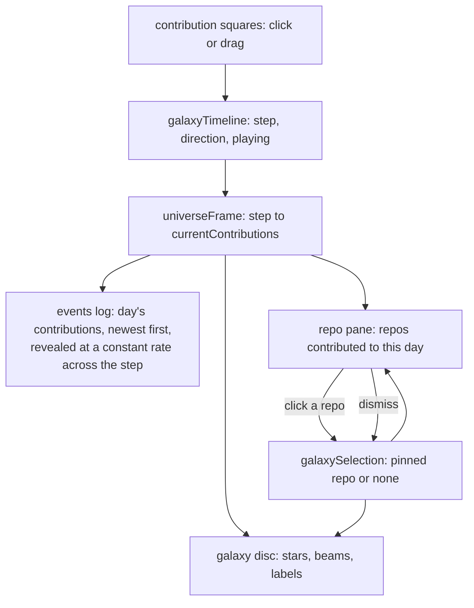
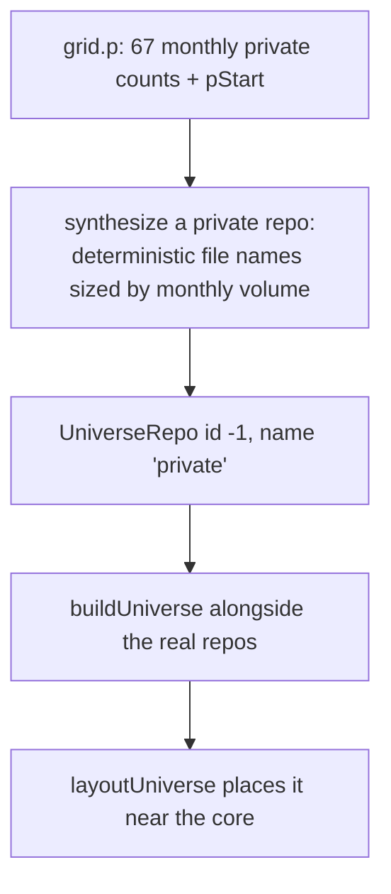

# Galaxy Round 7 - Plan

## Goal Capsule

- **Objective.** Correct the galaxy's opening view, make the instrument's three panes reflect the current day, and give private contributions a visible home in the disc.
- **Product authority.** The operator (Kevin Weaver). kevinweaver.dev is the surface that counts; work reaches it by merging to `main`.
- **Open blockers.** None. One item — private contributions — rests on an assumption about data that does not exist per-day; see KTD5 and Assumptions.

---

## Summary

Eight operator-directed corrections after seeing round 6 live: the camera opens from the wrong side, long repo labels clip, the events log and repo pane do not track the day being played, the contribution squares cannot be dragged, empty days are highlighted, private work is invisible, and a `bak` extension is noise.

## Problem Frame

Round 6 landed the single-disc galaxy, chunk pumping, camera controls, and the reworked ribbon. Watching it run surfaced defects that only appear with real data in motion.

The opening camera reads as though the viewer is beneath the disc looking up. The intent is a plate seen from across a table: the far edge high in frame, the near edge low.

The three panes do not agree about "now". The galaxy plays a day, but the events log shows a rolling tail rather than that day's contributions, and the repo pane sits empty until clicked. The instrument reads as three independent widgets rather than one clock.

Private contributions are 40% of the operator's activity on some months and currently render nowhere. The galaxy claims to show contribution history while silently omitting them.

## Requirements

**Opening view**

- R1. The disc opens tilted so its far edge sits higher in frame than its near edge, reading as a plate seen from across a table rather than from beneath.
- R2. The opening camera sits one zoom step closer than round 6's framing.

**Labels**

- R3. A repo label renders its full name legibly at any name length, without clipping or being constrained by a fixed texture width.

**Events log**

- R4. The events log lists only the contributions of the day being played, ordered most recent first.
- R5. Those lines appear one at a time at a constant rate, pacing the full day's contributions across that day's one-second slot rather than appearing at once.

**Repo pane**

- R6. With nothing selected, the repo pane lists the repos contributed to on the day being played.
- R7. Selecting a repo pins the pane to it and reveals a dismiss control that returns the pane to the day's list.
- R8. The extension list wraps across multiple lines rather than truncating, and never lists `bak`.

**Contribution graph**

- R9. Dragging across the contribution squares scrubs through time continuously; a single click still seeks one day.
- R10. A day with no contributions is not highlighted.

**Private contributions**

- R11. Private contributions render as beams into a repo labelled `private` positioned near the galactic center, presented like any other repo.

---

## Planning Contract

### Key Technical Decisions

- KTD1. **Flip the polar angle past the disc plane rather than negating the camera.** `DEFAULT_ORBIT.polar` is measured down from the up axis and currently sits at `PI / 4`, putting the camera on the same side as the disc's `+y`, which is what makes the near edge read high. Moving it to `3 * PI / 4` puts the camera on the other side of the plane, so the far edge rises in frame. The orbit reducer already clamps polar to `[POLAR_MARGIN, PI - POLAR_MARGIN]`, so this is inside the existing range and needs no clamp change. This is a screen-space claim, so it is settled by looking at a render, not by reasoning — the unit carries that instruction.

- KTD2. **Size the label texture to its text instead of a fixed 512x64.** `createLabelSprite` paints into a fixed canvas and the billboard plane carries a fixed aspect, so a long `owner/name` either overflows the texture or is squeezed. Measure the text, size the canvas to it, and derive the plane's aspect from the measured texture. Labels are already built once per repo at scene construction, so per-label measurement costs nothing per frame.

- KTD3. **Pace the events log from the shared clock's step, not from a wall-clock timer.** The step advances once per second and every surface already reads `galaxyTimeline`. Deriving how many of the day's lines are visible from elapsed-time-within-the-step keeps the log locked to the same clock the galaxy uses, survives scrubbing to an arbitrary day, and degrades correctly under `prefers-reduced-motion` by showing the day complete. A private `setInterval` per day would drift from the clock and would have to be torn down on every seek.

- KTD4. **Make the repo pane a mode, not a nullable selection.** The pane has two states — following the day, or pinned to a repo — rather than "selected or empty". `galaxySelection` currently models only the pinned case with `repoId: null` meaning empty; empty now means "follow the day". Clearing the selection is what the dismiss control does, and the pane falls back to the day's repos.

- KTD5. **Synthesize the private repo's stars; do not invent private history.** Private contributions exist in the payload only as `grid.p`, 67 **monthly** aggregate counts with a `pStart` month — there are no per-day, per-file private events, and none can be derived. The `private` repo therefore gets a deterministic, synthetic star field sized from the monthly totals, and its daily beams are driven by distributing a month's count across that month's days. This is a presentation of real aggregate volume, not fabricated file history, and the plan states that plainly rather than implying the galaxy knows which private files changed.

- KTD6. **Filter `bak` at render, not in the pipeline.** `bak` arrives in `repos.json`'s `x` array for three repos. Fixing it at the source means regenerating the bundle, which needs GitHub credentials this environment lacks, so the committed data would stay wrong until CI next runs. A render-side filter is correct immediately and stays correct after regeneration.

### High-Level Technical Design

The instrument's three panes are one clock with three views. Round 7 makes that literal: every pane derives from the same step, and the only per-pane state is presentation.



The private repo joins the layout as an ordinary `UniverseRepo` before `layoutUniverse` runs, so every downstream surface — stars, labels, beams, hit-testing, the repo pane — treats it like any other repo with no special-casing.



### Assumptions

- The operator accepts that private beams are distributed from monthly aggregates, because per-day private data does not exist in the payload and cannot be recovered without a pipeline change and new API scopes.
- "Zoom in by 1" means one step of the existing zoom control, not one world unit.
- The private repo sits near the core because the operator described it as "near the center". Since radius encodes recency, this is a deliberate exception to that mapping and is worth a look once rendered.

### Sequencing

U1, U2, U6, and U8 are independent and can land in any order. U3 and U4 both consume the day's contributions and should follow each other. U5 touches only the ribbon. U7 is the largest and touches the layout, so it lands last to avoid churning the other units' fixtures.

---

## Implementation Units

### U1. Correct the opening camera

- **Goal.** The disc opens as a plate seen from across a table, one zoom step closer.
- **Requirements.** R1, R2. Implements KTD1.
- **Dependencies.** None.
- **Files.** `lib/viz/orbit.ts`, `lib/viz/orbit.test.ts`.
- **Approach.** Move `DEFAULT_ORBIT.polar` from `PI / 4` to `3 * PI / 4` so the camera crosses to the other side of the disc plane, and reduce `distance` by one zoom step (match the step the zoom buttons apply, rather than picking an unrelated number).
- **Execution note.** The success condition is what the screen looks like, not what the number is. Render the page and confirm the far edge of the disc sits higher in frame than the near edge before considering this done; if `3 * PI / 4` reads wrong, the sign convention is the thing to re-derive, not the requirement.
- **Test scenarios.**
  - The opening camera sits on the opposite side of the disc plane from round 6, expressed as the sign of its y position.
  - The opening polar angle is inside the reducer's existing clamp range.
  - The opening distance is one zoom step nearer than before, and still within the dolly clamps.
  - A full azimuth spin returns the camera to its opening position.
- **Verification.** The disc reads as a plate seen from across a table in a rendered screenshot.

### U2. Make repo labels legible at any length

- **Goal.** A long `owner/name` renders in full rather than clipping or squeezing.
- **Requirements.** R3. Implements KTD2.
- **Dependencies.** None.
- **Files.** `packages/aiur-galaxy/src/galaxyLabels.ts`, `packages/aiur-galaxy/test/galaxyLabels.test.ts`.
- **Approach.** Measure the label text, size the backing canvas to the measured width plus padding, and derive the billboard plane's aspect from that texture instead of a constant. Keep the on-screen height stable so labels stay a consistent size relative to each other; only the width varies.
- **Test scenarios.**
  - A long repo name produces a wider texture than a short one, and both paint their full text.
  - The billboard plane's aspect matches its texture's aspect, so no label is horizontally squeezed.
  - Rendered label height is the same for a short and a long name.
  - Label texture dimensions stay within the WebGL maximum for a pathologically long name.
  - `dispose()` still releases every label texture.
- **Verification.** The longest repo name in the payload renders fully and unsqueezed.

### U3. Stream the day's contributions in the events log

- **Goal.** The log shows exactly the day being played, newest first, filling in one line at a time across that day's slot.
- **Requirements.** R4, R5. Implements KTD3.
- **Dependencies.** None.
- **Files.** `components/viz/EventsTail.tsx`, `components/viz/EventsTail.test.tsx` (new).
- **Approach.** Replace the rolling tail with the current step's contributions, ordered most recent first. Derive the visible count from how far the current step has progressed through its one-second slot, so a day with 40 contributions reveals roughly one every 25ms and a day with 3 reveals one every 333ms — constant within the day, always complete by the time the step advances. Under `prefers-reduced-motion`, and when the clock is paused or the user has scrubbed, show the day complete rather than animating.
- **Execution note.** The reveal is derived from clock progress, not accumulated in a ref. Seeking to a day must show the same thing as playing to it.
- **Test scenarios.**
  - The log lists only the current step's contributions.
  - Ordering is most recent first.
  - At the start of a step, fewer lines are visible than at the end.
  - By the end of a step, every one of that day's contributions is visible, for both a 3-contribution day and a 40-contribution day.
  - A day with no contributions renders the empty state without error.
  - Under reduced motion, the day renders complete immediately.
  - Seeking to a step shows the same lines as playing to it.
  - Advancing the step clears the previous day's lines.
- **Verification.** Watching playback, lines fill smoothly within each second and never spill past the day.

### U4. Default the repo pane to the day's repos

- **Goal.** The pane follows the day until the viewer pins a repo, and offers a way back.
- **Requirements.** R6, R7, R8. Implements KTD4, KTD6.
- **Dependencies.** U3 (shares the day's-contributions derivation).
- **Files.** `components/viz/RepoInfo.tsx`, `components/viz/RepoInfo.module.css`, `components/viz/RepoInfo.test.tsx`, `components/viz/galaxySelection.ts`.
- **Approach.** Two modes: following the day (list the repos contributed to on the current step) and pinned (the existing single-repo detail plus a dismiss control that clears the selection). Treat an empty selection as "follow the day" rather than "nothing to show". Let the extension list wrap across lines instead of truncating on one, and filter `bak` out of the extensions before rendering.
- **Test scenarios.**
  - With no selection, the pane lists the repos contributed to on the current step.
  - The list updates when the step advances.
  - A day with no contributions renders a sensible empty state.
  - Clicking a repo pins the pane to it and shows the dismiss control.
  - Dismissing returns the pane to the day's list.
  - The dismiss control is keyboard-operable and at least 24x24 CSS pixels.
  - An extension list longer than one line wraps rather than truncating.
  - `bak` never appears, for a repo whose payload extensions include it.
- **Verification.** The pane tracks playback with nothing selected, pins on click, and releases on dismiss.

### U5. Drag the contribution squares to scrub

- **Goal.** Dragging across the squares scrubs continuously; a click still seeks one day.
- **Requirements.** R9.
- **Dependencies.** None.
- **Files.** `components/viz/useRibbonInteraction.ts`, `components/viz/Ribbon.test.tsx`.
- **Approach.** The ribbon already maps a press to a day and a drag to a relative walk. Confirm what is actually wired, and make a press-and-move gesture scrub continuously across days while a press-and-release still seeks the single day under the pointer. Use pointer capture so a drag that leaves the strip keeps scrubbing.
- **Test scenarios.**
  - Pressing a square seeks exactly that day.
  - Dragging left and right scrubs continuously through days.
  - A drag that leaves the strip keeps scrubbing rather than stranding.
  - A press with no movement is a seek, not a scrub.
  - The galaxy follows the scrub, since both read the shared clock.
- **Verification.** Dragging across the strip moves the galaxy's day continuously.

### U6. Stop highlighting empty days

- **Goal.** A day with no contributions carries no current-day highlight.
- **Requirements.** R10.
- **Dependencies.** None.
- **Files.** `components/viz/ribbonPaint.ts`, `components/viz/ribbonWindow.test.ts` or the paint test alongside it.
- **Approach.** The current-day ring is drawn unconditionally. Draw it only when that day has at least one contribution. Keep the paint deterministic — it is screenshot-tested.
- **Test scenarios.**
  - A current day with contributions is highlighted.
  - A current day with zero contributions is not.
  - Every colour written is a concrete hex, never a CSS `var()`.
  - Two paints of the same step produce identical draw calls.
- **Verification.** Scrubbing onto an empty day shows no ring.

### U7. Give private contributions a place in the galaxy

- **Goal.** Private work appears as a `private` repo near the core, with beams, like any other repo.
- **Requirements.** R11. Implements KTD5.
- **Dependencies.** U1, U2, U3, U4, U6.
- **Files.** `packages/aiur-galaxy/src/buildUniverse.ts`, `packages/aiur-galaxy/test/buildUniverse.test.ts`, `packages/aiur-galaxy/src/galaxy.ts`, `packages/aiur-galaxy/test/galaxy.test.ts`, `components/viz/GalaxyUniverse.tsx`.
- **Approach.** Synthesize one extra repo from `grid.p` before the universe is built, so everything downstream treats it as ordinary. Its star count comes from the monthly totals; its per-day contributions come from distributing each month's count across that month's days deterministically. Give it a reserved id that cannot collide with a real repo id, and place it near the core — since radius encodes recency, this is an explicit exception, so make the placement deliberate rather than emergent.
- **Execution note.** Read `grid.p` and `grid.pStart` before designing the distribution; there are 67 monthly buckets and no finer resolution. Do not present the result as per-file history — the stars are synthetic volume, and the code should say so where a reader would otherwise assume otherwise.
- **Test scenarios.**
  - A universe built with private data contains a repo named `private`.
  - Its star count scales with total private volume.
  - Its id collides with no real repo id.
  - The same payload produces an identical private repo across two builds.
  - A month's private count is fully distributed across that month's days.
  - A payload with no private data produces no private repo and does not error.
  - Private contributions produce beams on days they land.
  - The private repo lays out nearer the core than the median repo.
- **Verification.** A `private` label sits near the core and takes beams during playback.

### U8. Drop `bak` and wrap the extension list

- **Goal.** `bak` never renders, and long extension lists wrap.
- **Requirements.** R8. Implements KTD6.
- **Dependencies.** None. Folded into U4 if that unit lands first; kept separate here because it is independently shippable.
- **Files.** `components/viz/RepoInfo.tsx`, `components/viz/RepoInfo.module.css`, `components/viz/RepoInfo.test.tsx`.
- **Approach.** Filter `bak` from the extension array at render, and let the list wrap instead of clipping to one line.
- **Test scenarios.**
  - A repo whose payload extensions include `bak` renders without it.
  - A repo with no `bak` renders unchanged.
  - A long extension list wraps and remains fully readable.
- **Verification.** The three repos carrying `bak` render clean.

---

## Verification Contract

| Gate | Command | Applies to |
| --- | --- | --- |
| Types | `npm run typecheck` | All units |
| Lint, zero new warnings | `npm run lint` | All units |
| Unit and browser tests | `npm run test` | All units |
| Production build | `npm run build` | All units |
| Bundle and data budgets | `npm run size` | U2, U7 |
| First-load budget | `node scripts/ci/check-first-load.mjs` | U2, U7 |
| End-to-end | `npx playwright test` | U5, U6, U7 |

The deferred galaxy island had 61 bytes of headroom at the end of round 6. U2 and U7 both add code to it, so `check-first-load.mjs` is a real constraint on this round, not a formality. If it fails, the levers already identified are moving labels to the DOM or dropping the `/dag` route's island — do not raise the budget.

Visual baselines are regenerated only in the pinned container, in a commit whose subject is exactly `Regenerate visual baselines in container`:

```bash
docker run --rm --ipc=host -v "$PWD":/w -w /w -e KW_IN_CONTAINER=1 \
  mcr.microsoft.com/playwright:v1.62.1-noble \
  sh -c "npm run build && npx playwright test --project=desktop-2x -u"
```

## Definition of Done

- The disc opens as a plate seen from across a table, one zoom step closer.
- Every repo label renders its full name unsqueezed.
- The events log shows the played day's contributions, newest first, filling in across the second.
- The repo pane follows the day until a repo is pinned, and offers a way back.
- Dragging the contribution squares scrubs; clicking seeks; empty days are unhighlighted.
- A `private` repo sits near the core and takes beams.
- No `bak` anywhere; long extension lists wrap.
- The full gate is green, every budget passes, and the accessibility suite reports zero violations.
